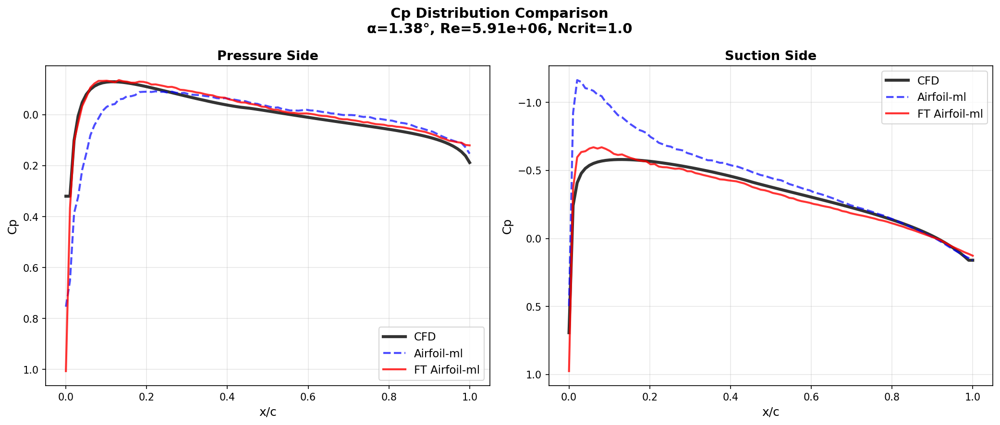

## Overview
This project is the latest version of trying to build a model that could be a practical airfoil aerodynamics analysis tool similar to Xfoil but more robust and rapid.
XFOIL is a widely-used, open-source tool for preliminary airfoil design and analysis. While high-fidelity CFD is often used for final certification in the aerospace industry, XFOIL remains a staple in academic settings and for initial design iterations in industry due to its speed and accuracy for subsonic flows.
The power of XFOIL is its ability to generate vast amounts of data. However, manually running and analyzing simulations for numerous airfoils across various conditions is time-consuming.
The power of XFOIL is its ability to generate vast amounts of data. However, manually running and analyzing simulations for numerous airfoils across various conditions is time-consuming. So, I tried using this dataset to explore and build a predictive model for airfoil performance.

---
### The journy:
- The project began by converting a large JSON dataset into csv. A MLP built with TensorFlow, testing various architectures, scaling methods, and activation functions, k-folds. [Airfoil analysis using TF](https://github.com/faaarv/airfoilML)
- The entire workflow migrated to PyTorch and used a more efficient dataset format. [Airfoil analysis using Pytorch](https://github.com/faaarv/airfoil-ml-pytorch)
- The model architecture was refined, a critical GroupShuffleSplit strategy was implemented to prevent geometry leakage.Trained model to predict both the pressure coefficient (Cp) distribution and four key aerodynamic coefficients. Tested for an unseen geometry and showed good prediction capabilities. [ML Surrogate for XFOIL](https://github.com/faaarv/airfoil-ml)
- The model architecture changed to predict just Cp, then a correction model trained to make corrections to the prediction of previous model.Demonstrating that the errors between XFOIL and turbulent CFD were learnable. [Correction model for airfoil-ml prediction](https://github.com/faaarv/airfoil-ml-cm)
- **Changing the model architecture and also fine-tuning the pre-trained model with CFD dataset. (current Repository)** 
---
While the initial model successfully replicated XFOIL's predictions, it was inherently limited by the physics of XFOIL's potential flow solver,  which struggles with accurately modeling complex phenomena like turbulence. XFOIL prediction for turbulent flow is a significant simplification of real-world physics. The next logical step was to explore methods to elevate the model's capabilities into this more challenging regime.

The goal was to leverage a smaller, high-fidelity CFD dataset—focused on challenging turbulent flows—to teach our model the nuances of advanced aerodynamics, bridging the gap between fast predictions and high-fidelity truth.

1.  **Architecture Refinement:** The base model architecture was further changed and optimized, using encoder-decoder and separate heads for pressure distribution for each side. 
2.  **Checkpoint Loading:** The model was initialized with the weights (checkpoint).
3.  **Fine-Tuning on Turbulent CFD Data:** The entire model was then fine-tuned on the smaller, high-quality turbulent flow CFD dataset.

The results of this fine-tuned model on unseen data(not in both dataset):

